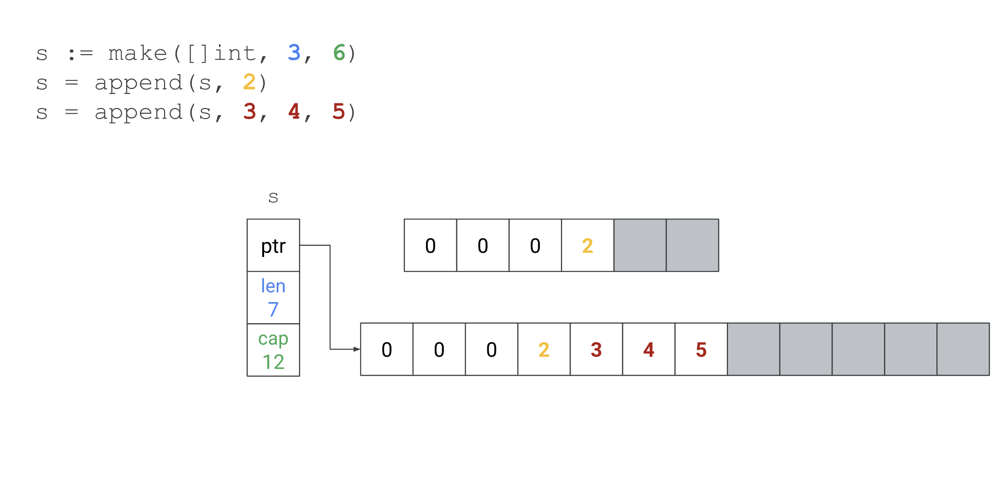

# **Basics of Go programming**

---

# Key Concepts:

- Go is statically typed and compiled.
- Simplistic syntax with built-in support for concurrency.
- The basic building blocks are packages, and the `main` package serves as the entry point.

## Example: "Hello, Go!"

```go
package main

import "fmt" // Importing the format package

func main() {
    fmt.Println("Hello, Go!") // Print to the console
}
```

---

## Explanation:

- `package main`: Defines the package, and `main` is the starting point of execution.
- `import`: Includes standard or third-party libraries.
- `func main()`: Declares the main function, the execution entry point.

## **How to run a go program ?**

### Option 1: Using `go run`

- Save your Go code to a file, e.g., `hello.go`:
- Run the program:
  ```bash
  go run hello.go
  ```
  - Output: `Hello, Go!`

### Option 2: Using `go build`

- Build the program into an executable:
  ```bash
  go build hello.go
  ```
- Run the executable:
  ```bash
  ./hello
  ```
  - Output: `Hello, Go!`

# 🚀 **What is a Goroutine in Go?**

A **goroutine** is a lightweight **thread-like construct** in Go used to achieve **concurrency**. It allows you to run functions independently and simultaneously without blocking the main execution thread.

---

## 📝 **Key Characteristics of Goroutines**

1. **Lightweight:**

   - Goroutines are much lighter than OS threads.
   - They start with a **small memory stack** (around 2KB) that grows and shrinks dynamically.

2. **Managed by Go Runtime Scheduler:**

   - Go uses a **Goroutine Scheduler** to manage goroutines, mapping them efficiently to operating system threads (M:N threading model).

3. **Concurrency, not Parallelism:**

   - Goroutines provide **concurrency** (handling multiple tasks at the same time, but not necessarily simultaneously).
   - Parallelism happens if multiple threads are running on **multiple CPU cores**.

4. **Easy Syntax:**
   - Goroutines are created using the **`go` keyword** followed by a function call.

---

## 🛠️ **How to Create a Goroutine**

### **Basic Syntax:**

```go
go functionName()
```

#### **Example:**

```go
package main

import (
    "fmt"
    "time"
)

func sayHello() {
    fmt.Println("Hello from Goroutine!")
}

func main() {
    go sayHello() // Launching goroutine
    fmt.Println("Hello from Main Function!")

    time.Sleep(1 * time.Second) // Give goroutine time to complete
}
```

**Output:** _(Order might vary due to concurrency)_

```
Hello from Main Function!
Hello from Goroutine!
```

---

## 📝 **Understanding Goroutine Behavior**

1. **Function Call in Goroutine:**

   - A goroutine runs **independently** from the calling function.
   - Once a goroutine is launched, the caller does **not wait** for it to complete.

2. **Main Goroutine:**
   - The `main` function itself runs in the **main goroutine**.
   - If the `main` function exits, **all other goroutines will terminate abruptly**, even if they are still running.

**Example of Premature Termination:**

```go
package main

import "fmt"

func sayHello() {
    fmt.Println("Hello from Goroutine!")
}

func main() {
    go sayHello()
    // No time.Sleep, main ends immediately
}
```

**Output:** _(May not print anything because main exits immediately.)_

---

## 📊 **Goroutines vs Threads**

| Feature           | Goroutines              | OS Threads    |
| ----------------- | ----------------------- | ------------- |
| **Weight**        | Lightweight (2KB stack) | Heavy         |
| **Management**    | Go runtime scheduler    | OS Kernel     |
| **Cost**          | Low overhead            | High overhead |
| **Scaling**       | Can handle thousands    | Limited by OS |
| **Communication** | Channels                | Shared memory |

---

# **Go Data Types**

In Go, every variable has a specific type, which determines the kind of data it can hold. Let's dive into each data type with examples.

---

## **1. Basic Types**

### a. **Numeric Types**

- **Integers**: Signed (`int`, `int8`, `int16`, `int32`, `int64`) and Unsigned (`uint`, `uint8`, `uint16`, `uint32`, `uint64`).
- **Floating-point**: `float32`, `float64`.
- **Complex**: `complex64`, `complex128`.

**Example**:

```go
package main
import "fmt"

func main() {
    var a int = 10           // Signed integer
    var b uint = 20          // Unsigned integer
    var c float64 = 3.14     // Floating-point
    var d complex128 = 1+4i  // Complex number

    fmt.Println(a, b, c, d)
}
```

---

### b. **Boolean**

- Represents `true` or `false`.

```go
var isActive bool = true
```

---

### c. **Strings**

- Immutable sequence of characters.

```go
package main
import "fmt"

func main() {
    var greeting string = "Hello, Go!"
    fmt.Println(greeting)
}
```

---

### **2. Aggregate Types**

### a. **Arrays**

- A **fixed-size collection** of elements of the same type.
- The size of the array is part of its **type** (e.g., `[5]int` is different from `[10]int`).
- Cannot grow or shrink in size after creation.

```go
package main
import "fmt"

func main() {
    var arr [3]int = [3]int{1, 2, 3}
    fmt.Println(arr)
}
```

---

### b. **Slices**

- A **dynamic-sized collection** of elements of the same type.
- A **slice is a reference to an underlying array**.
- Can grow or shrink in size dynamically.

```go
package main
import "fmt"

func main() {
    slice := []int{1, 2, 3, 4, 5}
    fmt.Println(slice)
}
```

```go
slice := make([]int, 3, 6)
```





### **Summary on arrays and slice**

| Feature        | Array                    | Slice               |
| -------------- | ------------------------ | ------------------- |
| **Size**       | Fixed                    | Dynamic             |
| **Memory**     | Contiguous allocation    | Reference to array  |
| **Length**     | Fixed at declaration     | Dynamic (len, cap)  |
| **Zero Value** | `[0,0,0]`                | `nil`               |
| **Pass By**    | Value                    | Reference           |
| **Comparison** | Comparable (`==`)        | Only with `nil`     |
| **Usage**      | Static-sized collections | Dynamic collections |

---

### c. **Maps**

In Go, `map` is a built-in data type used to store **key-value pairs**. The `make` function is commonly used to **initialize** maps.

### Create a Map Using `make`

### **Syntax:**

```go
mapVariable := make(map[keyType]valueType)
```

- **`keyType`**: The type of keys in the map (e.g., `string`, `int`).
- **`valueType`**: The type of values in the map (e.g., `string`, `int`).

---

```go
    m := make(map[string]int)
	m["Alice"] = 25
	m["Bob"] = 30
	m["Vince"] = 65

	fmt.Println("Snippet 2, \nMap = ", m)

	fmt.Println("Taking Alice = ", m["Alice"])
	if value, exist := m["Bob"]; exist {
		fmt.Println("Taking Bob = ", value)
	}

	fmt.Println("Iterating Map")
	for key, value := range m {
		fmt.Println(key, " = ", value)
	}

	delete(m, "Alice")
	fmt.Println("Deleting Alice = ", m)
```

### Create a Map without `make`

```go
package main
import "fmt"

func main() {
    m := map[string]int{"Alice": 25, "Bob": 30}
    fmt.Println(m)
}
```

### Empty Map Initialization Without `make`

If you want to start with an empty map, you can do:

```go
myMap := map[string]int{}
myMap["key"] = 42
fmt.Println(myMap)
```

---

### d. **Structs**

- Custom data types to group fields.
- Always prefer grouping fields by size in descending order (largest to smallest).

```go
package main
import "fmt"

type Person struct {
    Name string
    Age  int
}

func main() {
    p := Person{Name: "Alice", Age: 25}
    fmt.Println(p)
}
```

When defining **methods** on a struct in Go, you can choose between a **receiver by value** or a **receiver by pointer**. Each has its own use case.

### Receiver by Value

When you define a method with a value receiver, a **copy of the struct** is made when the method is called.

```go
package main

import "fmt"

type Person struct {
    Name string
    Age  int
}

// Receiver by Value
func (p Person) Greet() {
    fmt.Printf("Hello, my name is %s and I am %d years old.\n", p.Name, p.Age)
}

// Receiver by Value - Modifications won't persist
func (p Person) HaveBirthday() {
    p.Age++
    fmt.Println("Happy Birthday! (Inside Method) Age is now:", p.Age)
}

func main() {
    p := Person{Name: "Alice", Age: 25}
    p.Greet()
    p.HaveBirthday()
    fmt.Println("Outside Method Age is still:", p.Age)
}
```

- ✅ **Read-Only Access:** When the method **does not modify the struct's fields**.
- ✅ **Small Structs:** When the struct is small, copying it isn't costly.
- ✅ **Immutability:** Ensures the original struct remains unchanged.

### Receiver by Pointer

When you define a method with a pointer receiver, the **method operates directly on the struct's memory address**, allowing modifications to persist.

```go
package main

import "fmt"

type Person struct {
    Name string
    Age  int
}

// Receiver by Pointer
func (p *Person) Greet() {
    fmt.Printf("Hello, my name is %s and I am %d years old.\n", p.Name, p.Age)
}

// Receiver by Pointer - Modifications will persist
func (p *Person) HaveBirthday() {
    p.Age++
    fmt.Println("Happy Birthday! (Inside Method) Age is now:", p.Age)
}

func main() {
    p := Person{Name: "Bob", Age: 30}
    p.Greet()
    p.HaveBirthday()
    fmt.Println("Outside Method Age is now:", p.Age)
}
```

- ✅ **Modify the Struct:** When the method **needs to modify the struct's fields**.
- ✅ **Avoid Copying Large Structs:** When the struct is **large**, copying can be expensive.
- ✅ **Consistency:** When the struct has both read and write methods, use pointer receivers for consistency.

**Key Takeaway:** Use pointer receivers when you **need to modify the struct's fields** or when copying would be inefficient.

---

## **4. Interface**

In Go, an **interface** is a type that specifies a set of **method signatures**. Any type that implements those methods implicitly satisfies the interface.

### **Key Characteristics of Interfaces in Go:**

1. **Implicit Implementation:** A type satisfies an interface just by implementing its methods — no explicit declaration like `implements` or `extends`.
2. **Dynamic Behavior:** Interfaces allow you to define behavior without specifying concrete types.
3. **Polymorphism:** Interfaces enable functions to accept different types that satisfy the same interface.

```go
package main

import "fmt"

// Interface
type Walker interface {
	Walk() string
}

// Structs implementing the interface
type Human struct{}

func (h Human) Walk() string {
	return "Human is walking"
}

type Robot struct{}

func (r Robot) Walk() string {
	return "Robot is walking"
}

// Function accepting Walker interface
func StartWalking(w Walker) {
	fmt.Println(w.Walk())
}

func main() {
	h := Human{}
	r := Robot{}

	StartWalking(h) // Output: Human is walking
	StartWalking(r) // Output: Robot is walking
}
```

- `Human` and `Robot` both implement the `Walker` interface by having a `Walk()` method.
- The `StartWalking` function accepts any type that satisfies the `Walker` interface.

Interfaces are powerful in go because

1. ✅ **Flexibility:** You can write functions that operate on interfaces without being tied to specific types.
2. ✅ **Extensibility:** Adding new types that implement an interface doesn't require modifying existing code.
3. ✅ **Decoupling:** Interfaces decouple your code from concrete implementations, making it more modular.

**Note:** In **Go 1.18**, the `any` keyword was introduced as an **alias for the `interface{}` type**. It represents a **type that can hold any value**, essentially making it a way to define a variable of **any type**.

---

## **5. Special Types**

In Go, `byte` and `rune` are used to represent **characters** but have specific differences in how they handle text encoding and memory.

---

### 📚 **1. What is `byte`?**

- `byte` is an **alias for `uint8`** (unsigned 8-bit integer).
- It represents a **single ASCII character** (1 byte = 8 bits).
- Often used to represent raw **binary data** or **ASCII text**.

```go
package main

import "fmt"

func main() {
    var b byte = 'A' // ASCII value of 'A' is 65
    fmt.Printf("Value: %c, ASCII: %d, Type: %T\n", b, b, b)
}
```

**Output:**

```
Value: A, ASCII: 65, Type: uint8
```

- The character `'A'` is stored as its **ASCII value (65)** in an 8-bit `byte`.

### 📚 **2. What is `rune`?**

- `rune` is an **alias for `int32`** (signed 32-bit integer).
- It represents a **Unicode code point** (can represent more than just ASCII).
- Used to handle **multilingual text** or **special characters**.

```go
package main

import "fmt"

func main() {
    var r rune = '😊' // Unicode code point for '😊'
    fmt.Printf("Value: %c, Unicode: %U, Type: %T\n", r, r, r)
}
```

**Output:**

```
Value: 😊, Unicode: U+1F60A, Type: int32
```

- The character `'😊'` is represented by its **Unicode code point (U+1F60A)** and stored in a 32-bit `rune`.

### **3. String Representation with `byte` and `rune`**

In Go, **strings are immutable sequences of bytes**. Unicode strings are encoded in **UTF-8**.

```go
package main

import "fmt"

func main() {
    str := "Go😊"

    // Iterate as bytes
    fmt.Println("Bytes:")
    for i := 0; i < len(str); i++ {
        fmt.Printf("%d: %x\n", i, str[i])
    }

    // Iterate as runes
    fmt.Println("\nRunes:")
    for i, r := range str {
        fmt.Printf("%d: %c (%U)\n", i, r, r)
    }
}
```

**Output:**

```
Bytes:
0: 47
1: 6f
2: f0
3: 9f
4: 98
5: 8a

Runes:
0: G (U+0047)
1: o (U+006F)
2: 😊 (U+1F60A)
```

### Explanation:

- `byte` iteration shows the **UTF-8 byte sequence** of each character.
- `rune` iteration decodes the **Unicode code points**, treating multibyte characters (like 😊) correctly.

### 🛠️ **4. Differences Between `byte` and `rune`**

| **Aspect**     | **byte** (`uint8`)      | **rune** (`int32`)       |
| -------------- | ----------------------- | ------------------------ |
| **Alias For**  | `uint8`                 | `int32`                  |
| **Size**       | 1 byte (8 bits)         | 4 bytes (32 bits)        |
| **Represents** | ASCII character         | Unicode code point       |
| **Common Use** | Binary data, ASCII text | Multilingual text, UTF-8 |

### 🧠 **5. When to Use `byte` vs `rune`?**

- ✅ **Use `byte`**: When dealing with **raw bytes** or **ASCII text**.
- ✅ **Use `rune`**: When dealing with **Unicode characters** or **multilingual text**.

### 🔑 **6. Key Takeaways**

1. ✅ `byte` is an alias for `uint8` — for raw bytes and ASCII text.
2. ✅ `rune` is an alias for `int32` — for Unicode code points and multilingual text.
3. ✅ Strings in Go are UTF-8 encoded, and iterating them as `byte` or `rune` produces different results.

---

# **Understanding defer**

In **Go**, the `defer` statement is used to **postpone the execution of a function until the surrounding function returns**. This is particularly useful for **cleaning up resources**, **closing files**, **unlocking mutexes**, or **handling any finalization logic**.

- `defer` ensures that a function call is **executed just before the surrounding function exits**, regardless of whether it exits **normally** or **via a panic**.
- Deferred calls are **executed in LIFO (Last In, First Out) order**.

### **Basic Example:**

```go
package main

import "fmt"

func main() {
    defer fmt.Println("This will print last")
    fmt.Println("This will print first")
}
```

**Output:**

```
This will print first
This will print last
```

- `fmt.Println("This will print last")` is deferred and executed only when `main` is about to exit.

## **2. Multiple `defer` Statements (LIFO Order)**

Deferred functions are **stacked**, meaning they are executed in **reverse order** of their declaration.

```go
package main

import "fmt"

func main() {
    defer fmt.Println("Deferred 1")
    defer fmt.Println("Deferred 2")
    defer fmt.Println("Deferred 3")
    fmt.Println("Normal Execution")
}
```

**Output:**

```
Normal Execution
Deferred 3
Deferred 2
Deferred 1
```

- The **last defer statement (`Deferred 3`) is executed first**.

## **3. Practical Use Cases of `defer`**

### **a. Closing a File**

When working with files, `defer` ensures the file is closed even if an error occurs.

```go
package main

import (
    "fmt"
    "os"
)

func main() {
    file, err := os.Open("file.txt")
	if err != nil {
		panic("error while reading the file")
	}
	defer file.Close()
	data := make([]byte, 4096)
	for {
		n, err := file.Read(data)
		if errors.Is(err, io.EOF) {
			fmt.Println("Reached EOF")
			break
		}
		if n > 0 {
			fmt.Println(string(data[:n]))
		}
	}
}
```

## **4. Common Pitfalls 🚦**

1. **Deferred functions are not always executed in Goroutines.**  
   Deferred functions run when the **function exits**, not when a Goroutine exits.

2. **Heavy operations in `defer`.**  
   Avoid putting performance-intensive tasks inside `defer`.

3. **Order of execution.**  
   Always remember that deferred functions follow **LIFO order**.

---

# **Iteration and Control Statements in Go**

Go provides a minimal set of control flow statements, making it simple yet powerful for developers. Here's an overview of the most common iteration and control statements with examples.

---

## **1. `if` Statement**

- Used for conditional execution.
- Curly braces `{}` are mandatory even for single-line statements.
- No parentheses `()` around the condition.

### Syntax:

```go
if condition {
    // Code to execute if condition is true
} else if anotherCondition {
    // Code for another condition
} else {
    // Code if all conditions are false
}
```

### Example:

```go
package main
import "fmt"

func main() {
    num := 5

    if num%2 == 0 {
        fmt.Println("Even")
    } else {
        fmt.Println("Odd")
    }
}
```

### Output:

```plaintext
Odd
```

---

## **2. `for` Loop**

- The only looping construct in Go.
- Variants:
  1. Traditional `for` loop (with initialization, condition, increment).
  2. Simplified `for` loop (like a `while` loop).
  3. `for` with `range` (for iterating over collections).

---

### a. Traditional `for` Loop

```go
package main
import "fmt"

func main() {
    for i := 0; i < 5; i++ {
        fmt.Println("Iteration:", i)
    }
}
```

---

### b. Simplified `for` Loop

```go
package main
import "fmt"

func main() {
    num := 0
    for num < 3 { // Acts like a while loop
        fmt.Println("Num:", num)
        num++
    }
}
```

---

### c. `for` with `range`

- Used for iterating over arrays, slices, maps, strings, or channels.

```go
package main
import "fmt"

func main() {
    nums := []int{10, 20, 30}
    for index, value := range nums {
        fmt.Printf("Index: %d, Value: %d\n", index, value)
    }
}
```

### Output:

```plaintext
Index: 0, Value: 10
Index: 1, Value: 20
Index: 2, Value: 30
```

---

## **3. `switch` Statement**

- Used for multi-way branching.
- Evaluates conditions in order and executes the first matching case.
- `break` is implicit (unlike in C/C++/Java).

### Example:

```go
package main
import "fmt"

func main() {
    day := 3

    switch day {
    case 1:
        fmt.Println("Monday")
    case 2:
        fmt.Println("Tuesday")
    case 3:
        fmt.Println("Wednesday")
    default:
        fmt.Println("Invalid day")
    }
}
```

### Output:

```plaintext
Wednesday
```

---

## **4. `break` and `continue`**

- **`break`**: Exits the nearest loop immediately.
- **`continue`**: Skips the rest of the current iteration and moves to the next.

### Example:

```go
package main
import "fmt"

func main() {
    for i := 1; i <= 5; i++ {
        if i == 3 {
            continue // Skip the current iteration
        }
        if i == 5 {
            break // Exit the loop
        }
        fmt.Println(i)
    }
}
```

### Output:

```plaintext
1
2
4
```

---

## **5. Nested Loops**

- You can nest `for` loops, but make sure to use labels if you need to break out of outer loops.

### Example:

```go
package main
import "fmt"

func main() {
OuterLoop:
    for i := 0; i < 3; i++ {
        for j := 0; j < 3; j++ {
            if i == 1 && j == 1 {
                break OuterLoop
            }
            fmt.Printf("i: %d, j: %d\n", i, j)
        }
    }
}
```

### Output:

```plaintext
i: 0, j: 0
i: 0, j: 1
i: 0, j: 2
i: 1, j: 0
```

---

## **6. Infinite Loops**

- Use `for` without a condition for an infinite loop.
- Use `break` to exit the loop when required.

### Example:

```go
package main
import "fmt"

func main() {
    count := 0
    for {
        fmt.Println("Count:", count)
        count++
        if count == 3 {
            break
        }
    }
}
```

### Output:

```plaintext
Count: 0
Count: 1
Count: 2
```

---

These constructs provide the foundational building blocks for iteration and branching in Go. Let me know if you'd like detailed examples for any specific use case! 😊

## **Exercise**

Here’s a practical exercise to reinforce your understanding of Go data types.

---

### **Problem Statement:**

Write a Go program to manage a **student record system**. The system should:

1. Store details for each student using a **struct**. Include:

   - Name (`string`)
   - Age (`int`)
   - Marks in three subjects (`[3]int`)

2. Create a **array** of students to store records for multiple students.

3. Write a function to:

   - Calculate the **average marks** of each student.
   - Determine if the student passed or failed based on the average marks (`bool`). A passing average is 40 or above.

4. Store the result (average marks and pass status) in a **map** where the key is the student’s name, and the value is a struct or another map.

5. Display the results for all students.

---

### **Example Input:**

```go
{
    {"Alice", 18, [3]int{45, 50, 40}},
    {"Bob", 19, [3]int{30, 35, 25}},
    {"Charlie", 20, [3]int{60, 70, 80}}
}
```

### **Expected Output:**

```go
Name: Alice, Average Marks: 45, Pass: true
Name: Bob, Average Marks: 30, Pass: false
Name: Charlie, Average Marks: 70, Pass: true
```
