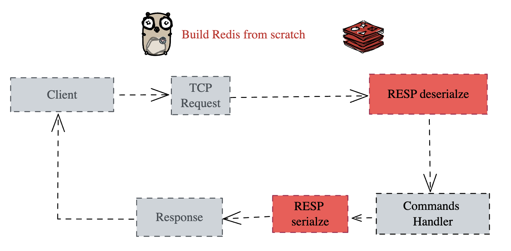

# **Building Redis**

## Introduction

Redis is an in-memory data structure store often used as a database, cache, message broker and streaming engine. In this workshop we will build our own Redis server that is capable of serving basic commands.



We will be supporting following commands

- PING
- ECHO
- SET
- GET
- DEL

Before we take up this challenge we will understand how to build TCP server in golang

## TCP Servers in Go

Go's [`net`](https://pkg.go.dev/net) package provides access to networking primitives.

To write TCP servers in Go, you'll need to be familiar with the following functions:

- [`net.Dial`](https://pkg.go.dev/net#Dial)
- [`net.Listen`](https://pkg.go.dev/net#Listen)
- [`net.Listener#Accept`](https://pkg.go.dev/net#TCPListener.Accept)
- [`net.Conn#Read`](https://pkg.go.dev/net#TCPConn.Read)
- [`net.Conn#Write`](https://pkg.go.dev/net#TCPConn.Write)

We'll start by looking at [`net.Dial`](https://pkg.go.dev/net#Dial) and [`net.Listen`](https://pkg.go.dev/net#Listen).

[`net.Dial`](https://pkg.go.dev/net#Dial) is used to initiate outbound connections.

Example usage:

```go
// Connects to a TCP server on localhost:8080
conn, err := net.Dial("tcp", "localhost:8080")
```

[`net.Listen`](https://pkg.go.dev/net#Listen) is used to create servers to accept inbound connections.

Example usage:

```go
// Starts a TCP server listening on localhost:8080
l, err := net.Listen("tcp", "localhost:8080")
```

Which method from the `net` package is used to create a TCP server?

`net.Dial`

`net.Listen`

`net.NewTCPServer`

Submit Show explanation

## The `net.Listen` function

This is the interface for [`net.Listen`](https://pkg.go.dev/net#Listen):

```go
func Listen(network string, address string) (Listener, error)
```

To create a TCP server, you'd specify "tcp" as `network`, and a string like "localhost:8080" as the `address`:

```go
// Starts a TCP server listening on localhost:8080
l, err := net.Listen("tcp", "localhost:8080")
```

How do you invoke `net.Listen` to start a TCP server on `localhost` port 8080?

`net.Listen("tcp_localhost:8080")`

`net.Listen("tcp", "localhost:8080")`

`net.Listen("localhost:8080")`

Submit Show explanation

## The `net.Listener` interface

[`net.Listener`](https://pkg.go.dev/net#Listener) is the interface returned from [`net.Listen`](https://pkg.go.dev/net#Listen).

```go
listener, err := net.Listen("tcp", "localhost:8080")
```

Here are the functions inside it:

```go
type Listener interface {
    // Accept waits for and returns the next connection to the listener.
    Accept() (Conn, error)

    // Close closes the listener.
    // Any blocked Accept operations will be unblocked and return errors.
    Close() error

    // Addr returns the listener's network address.
    Addr() Addr
}
```

Once you've created a listener, you can use [`net.Listener#Accept()`](https://pkg.go.dev/net#TCPListener.Accept) to wait for a client to connect.

This function blocks if no clients have connected to the server yet.

```go
// Block until we receive an incoming connection
conn, err := listener.Accept()
if err != nil {
    return err
}
```

What happens when you call `net.Listen()#Accept` and no clients have connected to the TCP server yet?

The server socket closes automatically.

It immediately returns with nil and no error

It waits until a client connects or an error occurs

Submit Show explanation

## The `net.Conn` interface

[`net.Conn`](https://pkg.go.dev/net#Conn) is the interface returned from [`net.Listener#Accept()`](https://pkg.go.dev/net#TCPListener.Accept).

The important functions in this interface are:

```go
type Conn interface {
    // Read reads data from the connection.
    Read(b []byte) (n int, err error)

    // Write writes data to the connection.
    Write(b []byte) (n int, err error)

    // Close closes the connection.
    // Any blocked Read or Write operations will be unblocked and return errors.
    Close() error
}
```

You can use [`conn.Read()`](https://pkg.go.dev/net#TCPConn.Read) and [`conn.Write()`](https://pkg.go.dev/net#TCPConn.Write) to read and write from a connection.

To read data from a connection, you'll need to pass in a byte slice to [`conn.Read`](https://pkg.go.dev/net#TCPConn.Read). The data received will be stored in this byte slice. [`conn.Read`](https://pkg.go.dev/net#TCPConn.Read) returns the number of bytes read:

```go
buf := make([]byte, 1024)
n, err := conn.Read(buf)
fmt.Printf("received %d bytes", n)
fmt.Printf("received the following data: %s", string(buf[:n]))
```

To write data to a TCP connection, you'll need to pass in a byte slice to [`conn.Write`](https://pkg.go.dev/net#TCPConn.Write). It returns the number of bytes written:

```go
message := []byte("Hello, server!")
n, err := conn.Write(message)
fmt.Printf("sent %d bytes", n)
```

What functions are used to read & write data to/from a `net.Conn` instance?

`Read()` and `Write()`

`Receive()` and `Send()`

`In()` and `Out()`

Submit Show explanation

Now that you're familiar with [net.Listen](https://pkg.go.dev/net#Listen), [net.Listener](https://pkg.go.dev/net#Listener) and [net.Conn](https://pkg.go.dev/net#Conn), let's see how to put them all together to create a simple TCP server that echos all input it receives:

```go
package main

import (
    "fmt"
    "net"
)

func main() {
    // Listen for incoming connections
    listener, err := net.Listen("tcp", "localhost:8080")
    if err != nil {
        fmt.Println("Error:", err)
        return
    }

    // Ensure we teardown the server when the program exits
    defer listener.Close()

    fmt.Println("Server is listening on port 8080")

    for {
        // Block until we receive an incoming connection
        conn, err := listener.Accept()
        if err != nil {
            fmt.Println("Error:", err)
            continue
        }

        // Handle client connection
        handleClient(conn)
    }
}

func handleClient(conn net.Conn) {
    // Ensure we close the connection after we're done
    defer conn.Close()

    // Read data
    buf := make([]byte, 1024)
    n, err := conn.Read(buf)
    if err != nil {
        return
    }

    fmt.Println("Received data", buf[:n])

    // Write the same data back
    conn.Write(buf[:n])
}
```

## Summary

You've now learnt about how to use functions in the [`net`](https://pkg.go.dev/net) package to build a TCP server.

A quick recap of the functions and interfaces we covered:

- [`net.Listen`](https://pkg.go.dev/net#Listen): Returns a [`net.Listener`](https://pkg.go.dev/net#Listener) instance
- [`net.Listener#Accept`](https://pkg.go.dev/net#TCPListener.Accept): Blocks until a client connects, returns a [`net.Conn`](https://pkg.go.dev/net#Conn) instance
- [`net.Conn#Read`](https://pkg.go.dev/net#TCPConn.Read): Reads data from a connection
- [`net.Conn#Write`](https://pkg.go.dev/net#TCPConn.Write): Writes data to a connection

The full documentation for the `net` package can be found [here](https://pkg.go.dev/net).

TCP is a widely used network protocol. It's the underlying protocol for HTTP, SSH and many other protocols that you're probably familiar with.

In this concept we'll learn how to write a TCP server in Go using the [`net`](https://pkg.go.dev/net) package.

Not familiar with TCP? Try the ["TCP: An Overview"](https://app.codecrafters.io/concepts/tcp-overview) concept first.

## The `net` package

Go's [`net`](https://pkg.go.dev/net) package provides access to networking primitives.

To write TCP servers in Go, you'll need to be familiar with the following functions:

- [`net.Dial`](https://pkg.go.dev/net#Dial)
- [`net.Listen`](https://pkg.go.dev/net#Listen)
- [`net.Listener#Accept`](https://pkg.go.dev/net#TCPListener.Accept)
- [`net.Conn#Read`](https://pkg.go.dev/net#TCPConn.Read)
- [`net.Conn#Write`](https://pkg.go.dev/net#TCPConn.Write)

We'll start by looking at [`net.Dial`](https://pkg.go.dev/net#Dial) and [`net.Listen`](https://pkg.go.dev/net#Listen).

[`net.Dial`](https://pkg.go.dev/net#Dial) is used to initiate outbound connections.

Example usage:

```go
// Connects to a TCP server on localhost:8080
conn, err := net.Dial("tcp", "localhost:8080")
```

[`net.Listen`](https://pkg.go.dev/net#Listen) is used to create servers to accept inbound connections.

Example usage:

```go
// Starts a TCP server listening on localhost:8080
l, err := net.Listen("tcp", "localhost:8080")
```

## The `net.Listen` function

This is the interface for [`net.Listen`](https://pkg.go.dev/net#Listen):

```go
func Listen(network string, address string) (Listener, error)
```

To create a TCP server, you'd specify "tcp" as `network`, and a string like "localhost:8080" as the `address`:

```go
// Starts a TCP server listening on localhost:8080
l, err := net.Listen("tcp", "localhost:8080")
```

## The `net.Listener` interface

[`net.Listener`](https://pkg.go.dev/net#Listener) is the interface returned from [`net.Listen`](https://pkg.go.dev/net#Listen).

```go
listener, err := net.Listen("tcp", "localhost:8080")
```

Here are the functions inside it:

```go
type Listener interface {
    // Accept waits for and returns the next connection to the listener.
    Accept() (Conn, error)

    // Close closes the listener.
    // Any blocked Accept operations will be unblocked and return errors.
    Close() error

    // Addr returns the listener's network address.
    Addr() Addr
}
```

Once you've created a listener, you can use [`net.Listener#Accept()`](https://pkg.go.dev/net#TCPListener.Accept) to wait for a client to connect.

This function blocks if no clients have connected to the server yet.

```go
// Block until we receive an incoming connection
conn, err := listener.Accept()
if err != nil {
    return err
}
```

## The `net.Conn` interface

[`net.Conn`](https://pkg.go.dev/net#Conn) is the interface returned from [`net.Listener#Accept()`](https://pkg.go.dev/net#TCPListener.Accept).

The important functions in this interface are:

```go
type Conn interface {
    // Read reads data from the connection.
    Read(b []byte) (n int, err error)

    // Write writes data to the connection.
    Write(b []byte) (n int, err error)

    // Close closes the connection.
    // Any blocked Read or Write operations will be unblocked and return errors.
    Close() error
}
```

You can use [`conn.Read()`](https://pkg.go.dev/net#TCPConn.Read) and [`conn.Write()`](https://pkg.go.dev/net#TCPConn.Write) to read and write from a connection.

To read data from a connection, you'll need to pass in a byte slice to [`conn.Read`](https://pkg.go.dev/net#TCPConn.Read). The data received will be stored in this byte slice. [`conn.Read`](https://pkg.go.dev/net#TCPConn.Read) returns the number of bytes read:

```go
buf := make([]byte, 1024)
n, err := conn.Read(buf)
fmt.Printf("received %d bytes", n)
fmt.Printf("received the following data: %s", string(buf[:n]))
```

To write data to a TCP connection, you'll need to pass in a byte slice to [`conn.Write`](https://pkg.go.dev/net#TCPConn.Write). It returns the number of bytes written:

```go
message := []byte("Hello, server!")
n, err := conn.Write(message)
fmt.Printf("sent %d bytes", n)
```

Now that you're familiar with [net.Listen](https://pkg.go.dev/net#Listen), [net.Listener](https://pkg.go.dev/net#Listener) and [net.Conn](https://pkg.go.dev/net#Conn), let's see how to put them all together to create a simple TCP server that echos all input it receives:

```go
package main

import (
    "fmt"
    "net"
)

func main() {
    // Listen for incoming connections
    listener, err := net.Listen("tcp", "localhost:8080")
    if err != nil {
        fmt.Println("Error:", err)
        return
    }

    // Ensure we teardown the server when the program exits
    defer listener.Close()

    fmt.Println("Server is listening on port 8080")

    for {
        // Block until we receive an incoming connection
        conn, err := listener.Accept()
        if err != nil {
            fmt.Println("Error:", err)
            continue
        }

        // Handle client connection
        handleClient(conn)
    }
}

func handleClient(conn net.Conn) {
    // Ensure we close the connection after we're done
    defer conn.Close()

    // Read data
    buf := make([]byte, 1024)
    n, err := conn.Read(buf)
    if err != nil {
        return
    }

    fmt.Println("Received data", buf[:n])

    // Write the same data back
    conn.Write(buf[:n])
}
```

## RESP (REdis Serialization Protocol) Overview

RESP (REdis Serialization Protocol) is the serialization protocol used by Redis for communication between clients and the Redis server. RESP is designed to be simple, efficient, and human-readable, yet powerful enough to support binary-safe communication.

---

### Key Features of RESP

1. **Lightweight**: The protocol is simple and minimalistic, which makes it efficient.
2. **Binary-Safe**: RESP can handle binary data like images and compressed files.
3. **Human-Readable**: Many parts of RESP messages are human-readable, making it easy to debug.
4. **Support for Pipelining**: Multiple requests can be sent without waiting for the previous response, improving throughput.
5. **Support for Multiple Data Types**: RESP supports strings, integers, arrays, and more.

---

### RESP Message Structure

Every RESP message consists of the following:

1. **Prefix**: Indicates the data type (e.g., `+`, `-`, `:`, `$`, `*`).
2. **Length**: Specifies the size of the data (if applicable).
3. **Payload**: Contains the actual data.
4. **Termination**: Each message ends with `\r\n` (Carriage Return and Line Feed).

---

## RESP Data Types

RESP defines several data types to represent different kinds of data. Below is a detailed explanation of each type with examples:

### 1. Simple Strings (`+`)

Simple strings are used to represent short, human-readable messages, usually for success responses.

#### Syntax:

```
+<message>\r\n
```

#### Example:

Client sends a `PING` command:

```
*1\r\n$4\r\nPING\r\n
```

Server receives:

```
*1
$4
PING
```

Server responds with a simple string:

```
+PONG\r\n
```

---

### 2. Errors (`-`)

Errors represent error messages from the server, typically indicating a problem with the client's request.

#### Syntax:

```
-<error message>\r\n
```

#### Example:

Client sends an unsupported command:

```
*1\r\n$4\r\nFOOBAR\r\n
```

Server receives:

```
*1
$4
FOOBAR
```

Server responds with an error:

```
-ERR unknown command 'FOOBAR'\r\n
```

---

### 3. Integers (`:`)

Integers are used to return numerical values, such as counters or sizes.

#### Syntax:

```
:<number>\r\n
```

#### Example:

Client increments a counter:

```
*3\r\n$6\r\nINCRBY\r\n$6\r\nmykey\r\n$2\r\n10\r\n
```

Server receives:

```
*3
$6
INCRBY
$6
mykey
$2
10
```

Server responds with the new value of the counter:

```
:10\r\n
```

---

### 4. Bulk Strings (`$`)

Bulk strings represent binary-safe strings. These can include any type of data, such as text or binary files.

#### Syntax:

```
$<length>\r\n<data>\r\n
```

If the length is `-1`, it represents a `null` bulk string.

#### Example:

Client sets a key-value pair:

```
*3\r\n$3\r\nSET\r\n$5\r\nmykey\r\n$7\r\nmyvalue\r\n
```

Server receives:

```
*3
$3
SET
$5
mykey
$7
myvalue
```

Server responds:

```
+OK\r\n
```

Client retrieves the value:

```
*2\r\n$3\r\nGET\r\n$5\r\nmykey\r\n
```

Server receives:

```
*2
$3
GET
$5
mykey
```

Server responds:

```
$7\r\nmyvalue\r\n
```

---

### 5. Arrays (`*`)

Arrays represent lists of elements, which can include other RESP types (e.g., strings, integers, bulk strings).

#### Syntax:

```
*<number of elements>\r\n<element1><element2>...<elementN>
```

If the number of elements is `-1`, it represents a `null` array.

#### Example:

Client sends a `MGET` command to retrieve multiple keys:

```
*3\r\n$4\r\nMGET\r\n$5\r\nkey1\r\n$5\r\nkey2\r\n
```

Server receives:

```
*3
$4
MGET
$5
key1
$5
key2
```

Server responds with an array of bulk strings:

```
*2\r\n$5\r\nvalue1\r\n$-1\r\n
```

Explanation:

- The first key (`key1`) exists and has a value of `value1`.
- The second key (`key2`) does not exist, represented by a `null` bulk string (`$-1`).

---

### Additional Notes:

- Arrays can be nested, allowing RESP to represent complex data structures.
- For example, a Redis transaction's responses can be an array of responses to individual commands.

---

## Advanced Topics in RESP

### Pipelining

- RESP allows clients to send multiple requests without waiting for individual responses, improving performance.

#### Example:

Client sends:

```
*3\r\n$3\r\nSET\r\n$5\r\nkey1\r\n$5\r\nvalue1\r\n
*3\r\n$3\r\nSET\r\n$5\r\nkey2\r\n$5\r\nvalue2\r\n
```

Server receives:

```
*3
$3
SET
$5
key1
$5
value1

*3
$3
SET
$5
key2
$5
value2
```

Server processes the commands and responds:

```
+OK\r\n
+OK\r\n
```

---

## Conclusion

RESP is a powerful, flexible, and efficient protocol that forms the backbone of Redis communication. By understanding its data types and structure, developers can optimize interactions with Redis and fully leverage its capabilities.
